# Hands-on Lab: Create and Publish Power BI Dashboards & Reports

### Estimated Duration: 4 Hours

## 📘 Scenario

In this lab, you will work with an existing report to publish it to the **Microsoft Power BI Service** and create an **interactive dashboard** by pinning important visuals. You will customize dashboard layouts, enable map visuals, and explore features such as drill-through, Q&A, quick insights, alerts, and bookmarks to improve report navigation and data storytelling. By the end of this hands-on lab, you will have a fully organized dashboard for analyzing business performance and sharing insights with stakeholders.

## 📖 Overview

In this lab, you'll use a pre-built Power BI report to publish it to the Power BI Service and create a dashboard by pinning key visuals. You'll explore features such as customizing the dashboard layout, enabling map visuals, and working with drill-through, quick insights, Q&A, alerts, and bookmarks to enhance the report experience.

## 🎯 Lab Objectives

- Task 1: Power BI Service – Publishing Report
- Task 2: Power BI – Building a Dashboard
- Task 3: Organize the dashboard
  
## Task 1: Power BI Service – Publishing Report

In this task, you will open a Power BI report, enable map visuals, adjust the mobile layout, create a workspace, and publish the report to the Power BI Service.

1. In the left-hand navigation pane of the Power BI interface, select **Workspaces** to view and manage your available workspaces.
   
    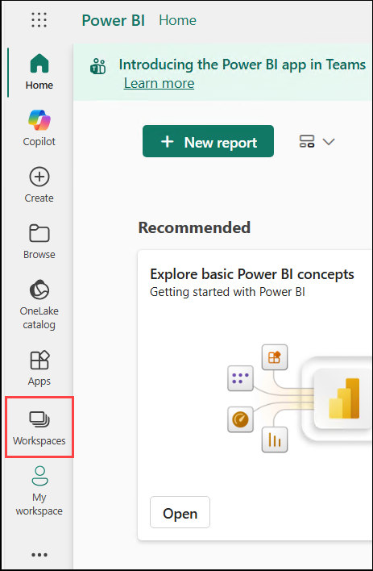

1. Click on **+ New workspace** at the bottom of the Workspaces pane. This will open the **Create a workspace** dialog box.

    

1. On the **Create a workspace** page, provide the following details.

    - In the **Name** field, enter **DIAD_<inject key="DeploymentID" enableCopy="false"/> (1)**.

    - In the **Description** field, type **This is DIAD workspace (2)**.

    - Click **Upload (3)** to upload an image that will serve as the workspace logo and help identify your workspace visually.

        

1. A file browser dialog box will open. Browse to the **DIAD** folder, then navigate to the **Data** folder at `C:\DIAD\DIADL4\Data`. Select the **VanArsdel\_WSLogo** **(1)** file and click **Open** **(2)**.

      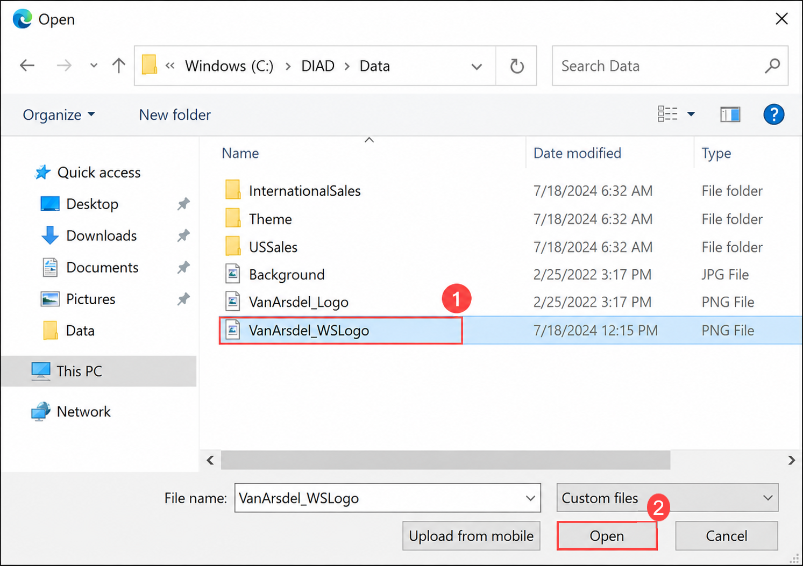

1. Click **Apply** to finalize and create the workspace with your configured settings.

    

    > 📌 **Note:** If prompted about a license, select **Try Free** to proceed.

    

1. Once the **DIAD_<inject key="DeploymentID" enableCopy="false"/>** workspace is created, navigate to **Manage Access (1)** to configure user permissions and access levels.

    

1. On the **Manage Access** window, click on **+Add people or groups (1)** to add new users or service principals to your workspace.

    

1. On the **+Add people or groups** window, search for the service principal using `https://cloudlabs-v2.ai/` and select it from the search results.

1. In the Add people pane, after selecting the service principle **(1)**, select the appropriate role from the drop down. Choose **Admin (2)** to grant administrative permissions, and then click **Add (3)** to confirm. Make sure that is listed on the **Manage access** window.

     

1. On the **Manage Access** page, you should see that your account and service principle is listed as an **Admin**.

    

1. Navigate back to the VM and open **File Explorer** from the toolbar. Navigate to `C:\DIAD\DIADL4\Reports` to locate your report files.

1. Open the **DIAD Final Report.pbix** file to begin preparing it for publication. 

    

   > 📌 **Note:** If you receive any pop-ups, please close them.

   .png)

   .png)

   .png)

1. On the **DIAD Final Report**, to enable the **Map and filled map visuals** like Power BI follow the below steps.

    - Click on **File** from the top left menu.

          

    - Click on **Options and settings (1)** from the left pane, then select **Options (2)** under the **Options and settings section**.

       

    - From the left-hand side pane, click on **Security** **(1)**, then under **Map and Filled Map visuals**, check **Use Map and Filled Map visuals** **(2)**, and click **OK** **(3)** to apply the changes.

        >By enabling the Map and Filled Map visuals setting, Power BI will be able to render geographic visualizations in your report. This setting is required for map-based visuals to display correctly.

       

1. Enhance the report title by selecting the **MARKET ANALYSIS (1)** title text. From the text formatting toolbar, click the font color **dropdown (2)**, and select **black (3)** color from the Theme colors palette to improve visibility.

    

1. To optimize your report for mobile devices, click the **View (1)** tab in the top menu, then select **Mobile layout (2)** to enter the mobile design mode.

   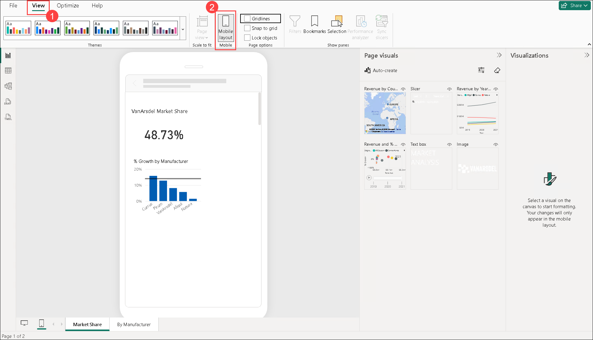 

   > 📌 **Note:** If a pop-up stating **"The mobile layout canvas is now interactive"** appears, click on **Close** to dismiss it.

1. In the mobile layout view, drag the **MARKET ANALYSIS** title to the top of the phone layout to ensure it's the first element users see on mobile devices.

   

      

   > 📌 **Note:** You can adjust the size of the text for better visual alignment on the mobile screen.

   > 📌 **Note:** If any additional pop-ups appear, click on **Close** to dismiss them.

1. Click on the **View** **(1)** tab and turn on the **Selection** **(2)** pane by clicking on it. This allows you to change the layer order while creating a mobile layout.

   

2. While still in the **View** **(1)** tab, turn off **Gridlines** and **Snap to Grid** **(2)**, and also turn off the **Selection pane** **(3)** once you've finished layering your elements.

   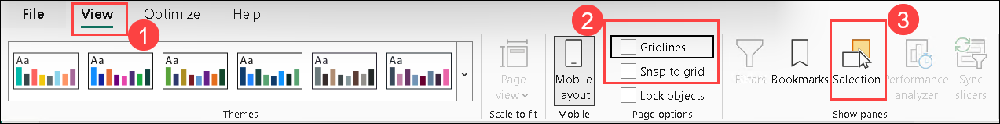

1. Drag the **Revenue by Year and Manufacturer** line chart below the card on the phone layout. Resize the line chart to stretch across the phone layout.

   

1. Drag the **Revenue by Country** map visual below the line chart on the phone layout. Resize the map to fit appropriately within the mobile screen dimensions.

   

1. Click the **Save** icon from the top-left corner to save your workbook with all the changes you've made.

   

1. Before publishing, ensure that **Mobile layout** is **turned off** by deselecting the **Mobile layout** option in the View tab. This returns the report to the standard desktop view.

    

1. From the **Home (1)** tab in the top ribbon, click on **Publish (2)** to publish your report to the Power BI Service.

    

1. If you're prompted to save the changes, click on **Save** to proceed.

    

1. In the **Publish to Power BI** dialog box, select **DIAD_<inject key="DeploymentID" enableCopy="false"/> (1)** from the dropdown list to specify your target workspace, and then click **Select (2)** to proceed with publication.

    

1. The **Publishing to Power BI** dialog box opens. Once the process is complete, a success message displays.
  
1. Click **Got it** to close the dialog box and complete the publishing process.

    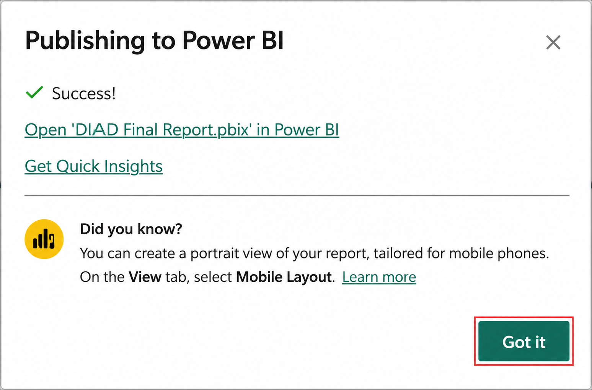

1. Now that the report has been successfully published to the Power BI Service, switch to your web browser to begin exploring the published content.
    
1. Once you are in the browser, check the left panel, notice that under **DIAD_<inject key="DeploymentID" enableCopy="false"/>** workspace, you see **Reports** has the **DIAD Final Report**.

     

    > 📌 **Note:** If the reports are not visible, please refresh the page.

> **Congratulations** on completing the task! Now, it's time to validate it. Here are the steps:
>
> - If you receive a success message, you can proceed to the next task.
> - If not, carefully read the error message and retry the step, following the instructions in the lab guide.
> - If you need any assistance, please contact us at cloudlabs-support@spektrasystems.com. We are available 24/7 to help you out.

<validation step="30855dc5-d65e-4b44-a618-7a82e83da605" />

## Task 2: Power BI – Building a Dashboard

In this task, you will create a dashboard that combines data from the **Market Share** report.  

By the end of this section, you will have created a dashboard that looks like the screenshot below.

  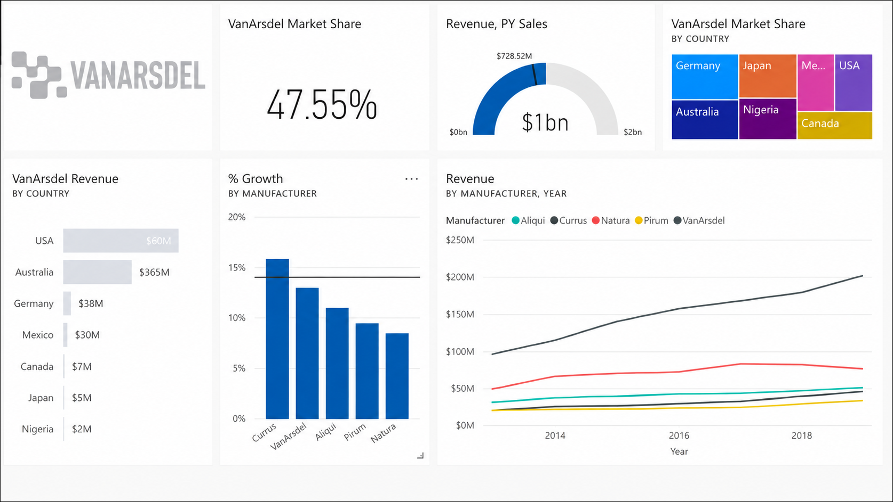

1. Click the **DIAD Final Report** of type **Report**. You will be navigated to the report you just uploaded.   

    
  
1. In the **map visual**, enable drill-down by hovering over the visual and clicking the **down arrow (1)** at the top-right corner of the visual. Then, click on **Australia (2)** to drill down to the **State** level.

    

    > 📌 **Note:** The map visual may take a few seconds to load initially. If it doesn't appear after a short wait, please try refreshing the page.

1. Hover over the **VanArsdel Market Share** card visual. Click the **pin** icon at the top-right corner of the visual. This will open the **Pin to dashboard** dialog box.

    

1. We do not have a dashboard yet. Let’s create one. With **New dashboard (1)** selected, enter **VanArsdel (2)** in the text box, then click on **Pin (3)**.
  
    
 
    > 📌 **Note:** If you see an option labeled **Tile Theming**, select **Use destination theme**.

    > 📌 **Note:** Notice that alert messages are displayed stating the dashboard is ready to view.

1. Notice that the **VanArsdel** dashboard is created under the **DIAD_<inject key="DeploymentID" enableCopy="false"/>** workspace. Click on it to open the dashboard.

    
  
1. Select **VanArsdel Market Share** to view the pinned visual.

    

    > Notice the **VanArsdel Market Share** tile is pinned to the dashboard.

1. After selecting **VanArsdel Market Share**, you are navigated directly to the report that the visual was pinned to.

    

1. Hover over the **% Growth by Manufacturer** visual. Click the **pin** icon on the top right of the visual. The **Pin to dashboard** dialog box opens.

    

1. To pin a visual to the **VanArsdel** dashboard in Power BI, select **Existing dashboard** **(1)** under the "Where would you like to pin to?" section, choose **VanArsdel** from the dropdown list **(2)**, and then click on **Pin** **(3)**.

    

    > 📌 **Note:** If you see an option labeled **Tile Theming**, select **Use destination theme**.

1. Close out the alert dialog boxes.

1. Hover over the **Revenue by Year and Manufacturer** visual. Click the **pin** icon on the top right of the visual. The **Pin to dashboard** dialog box opens.

    

1. To pin a visual to the **VanArsdel** dashboard in Power BI, select **Existing dashboard** **(1)** under the "Where would you like to pin to?" section, choose **VanArsdel** from the dropdown list **(2)**, and then click on **Pin** **(3)** to complete the process.

    
   
    > 📌 **Note:** If you see an option labeled **Tile Theming**, select **Use destination theme**.

1. Close out the alert dialog boxes.

1. Click on **By Manufacturer** **(1)** under the **Pages** pane to navigate to that specific report page.

    

1. From the top right corner, click the **down arrow**. Notice that the **manufacturer** slicer displays.

   

1. Click **VanArsdel** in the slicer. This will filter the visuals.

   

1. From the top right corner, click the **up arrow**. Notice that the **manufacturer** slicer collapses.
  
   

1. Click the **pin** icon on the **Revenue and PY Sales** (gauge) visual to pin it to the dashboard

   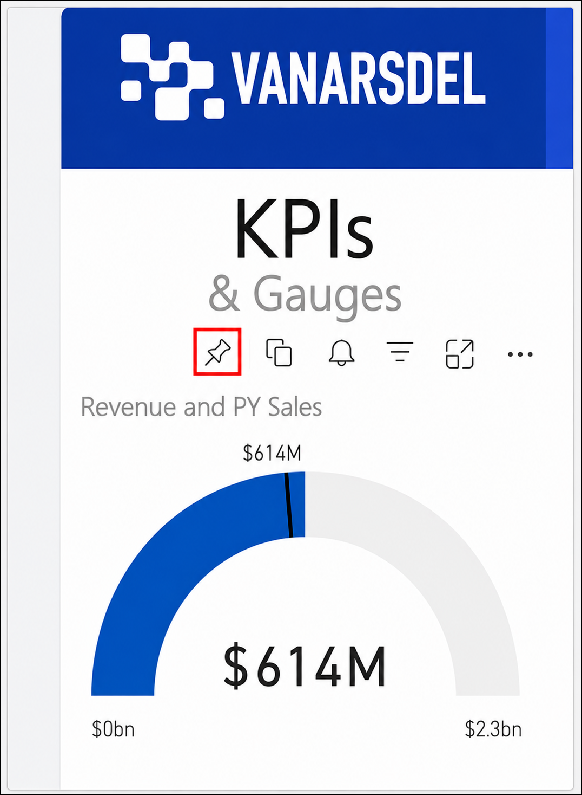

1. To pin a visual to the **VanArsdel** dashboard in Power BI, select **Existing dashboard** **(1)** under the "Where would you like to pin to?" section, choose **VanArsdel** from the dropdown list **(2)**, and then click on **Pin** **(3)**.

    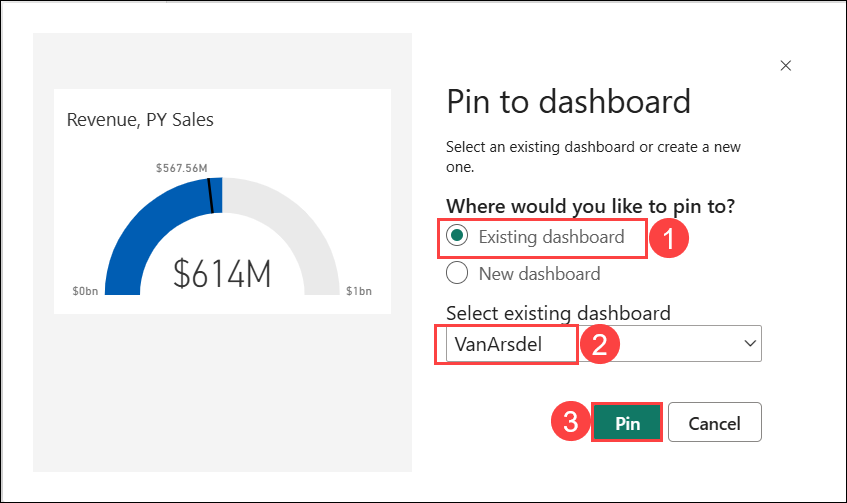

    > 📌 **Note:** If you see an option labeled **Tile Theming**, select **Use destination theme**.

1. **Pin** the **Revenue by Country** visual to the dashboard.

   

1. To pin a visual to the **VanArsdel** dashboard in Power BI, select **Existing dashboard** **(1)** under the "Where would you like to pin to?" section, choose **VanArsdel** from the dropdown list **(2)**, and then click on **Pin** **(3)**.

    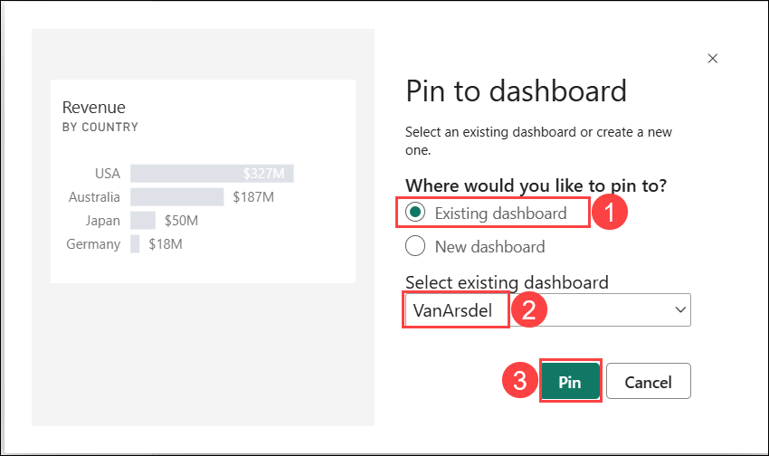   

    > 📌 **Note:** If you see an option labeled **Tile Theming**, select **Use destination theme**.

1. Close out the alert dialog boxes.
  
    > 📌 **Note:** The **VanArsdel** filter is applied to the tile that is pinned to the dashboard.

1. From the left panel, select the **DIAD_<inject key="DeploymentID" enableCopy="false"/> (1)**, click **VanArsdel (2)** Dashboard. Notice that all the visuals are pinned as tiles to the dashboard.

   .png)

   .png)    

    > 📌 **Note:** You will see the visuals on the dashboard like in the screenshot. Each visual on the dashboard is called a tile. The tiles represent the data chosen and are kept up to date as the data in the data model updates. Tiles are not interactive.

> **Congratulations** on completing the task! Now, it's time to validate it. Here are the steps:
>
> - If you receive a success message, you can proceed to the next task.
> - If not, carefully read the error message and retry the step, following the instructions in the lab guide.
> - If you need any assistance, please contact us at cloudlabs-support@spektrasystems.com. We are available 24/7 to help you out.

<validation step="5f6fd03e-f355-47b5-a327-bb0199fe5217" />

## Task 3: Organize dashboard

In this task, you will organize the Power BI dashboard by resizing tiles, adding images, renaming visuals, generating insights, setting alerts, using drill-through, and exploring bookmarks.

1. Resize and move the **gauge** tile as shown in the screenshot.

1. Click the bottom right corner of the tile and move it diagonally to change the image size.

    
  
    Tiles can be of various sizes (1x1 to 5x5). Drag the tile using the bottom right corner to resize it. 

1. Click the **Edit (1)** dropdown in the top-right corner of the dashboard and select **+ Add a tile (2)**.

    

1. On the **Add a tile** dialog box, click **Image (1)** as the source and select **Next (2)**.

    

1. In the Add image tile dialog box, enter the **URL**: `https://raw.githubusercontent.com/CharlesSterling/DiadManu/master/Vanarsdel.png` **(1)** and click **Apply (2)**.

    

   > 📌 **Note:** The URL is case sensitive.

1. Notice that a new tile with the **VANARSDEL** logo is added to the dashboard.

    
  
1. Resize and rearrange the tiles as shown in the screenshot.

    

1. The **Revenue by Country** tile shows Revenue by Country for VanArsdel, let’s rename it. Hover over **Revenue by Country** tile.

    

1. Click the ellipsis **(...) (1)** in the top right corner of the tile and then click **Edit details (2)**. The **Tile Details** dialog box opens.

    

1. On the **Tile Details** page, Change the **Title** to **VanArsdel Revenue (1)** then click **Apply (2)**

    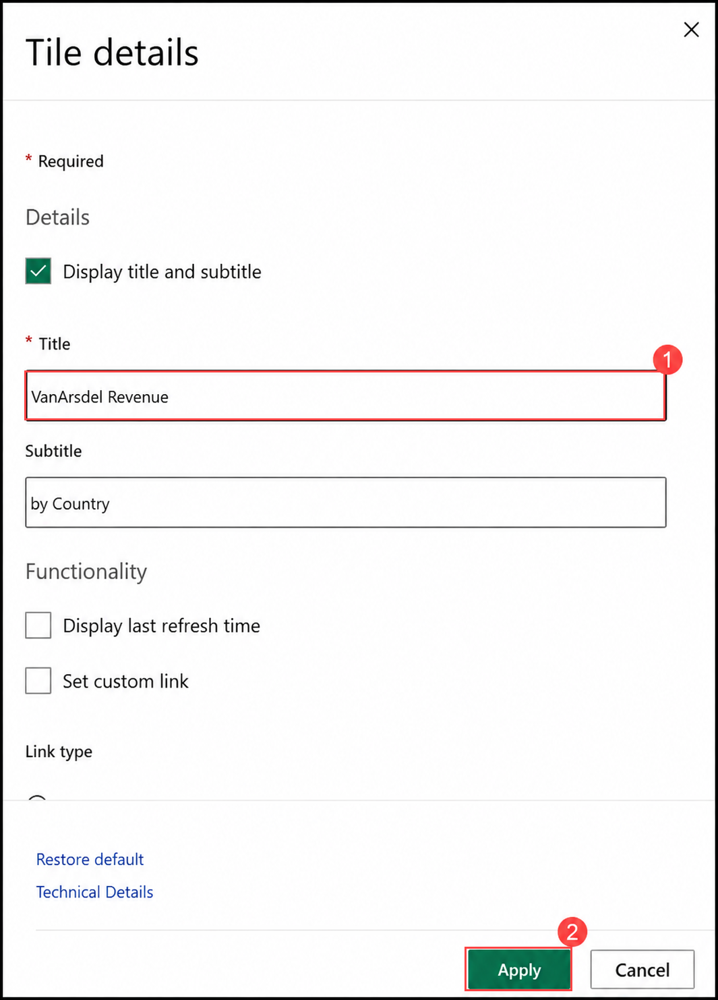

1. Now, let’s create a visual that represents Market Share by country.

1. Notice at the top of the visual, there’s an **Ask a question about your data** option, which works just like the *Ask a question feature on the desktop*, allowing you to interact with your data using natural language queries.

   

1. In the text box, start typing **VanArsdel market share (1)** then click arrow icon **-> (2)**. Notice that a card visual is created.

   

1. Continue typing **VanArsdel market share by country (1)** then click arrow icon **-> (2)**. Notice that a bar chart is created.

   

1. Continue typing **VanArsdel market share by country as treemap (1)** then click arrow icon **-> (2)**. Notice that a treemap visual is created.

    
  
    > 📌 **Note:** Remember that we renamed our tables. One of the reasons we did this was to make them user-friendly for Q & A

1. In the top right of the screen, click **Pin Visual**.

    

1. To pin a visual to the **VanArsdel** dashboard in Power BI, select **Existing dashboard** **(1)** under the "Where would you like to pin to?" section, choose **VanArsdel** from the dropdown list **(2)**, and then click on **Pin** **(3)**.

    
    
1. Close the alert dialog boxes.

1. Click **Exit Q&A** from the upper left corner to navigate back to the dashboard.

    

1. Notice that the visual is added as a tile to the dashboard, and clicking on the treemap visual will navigate you back to the Q&A section

    

    > 📌 **Note:** Power BI quickly searches different subsets of your dataset while applying a set of sophisticated algorithms to discover potentially interesting insights. You can run insights against a dataset or a dashboard tile.

1. Let’s generate insights on a dashboard tile. When we run insights on a dashboard tile, instead of searching for insights against an entire dataset, the search is narrowed to the data used to create a single dashboard tile. This is often referred to as scoped insights.

1. Hover over the **line chart** on the dashboard.

1. Click the **ellipsis (...) (1)** on the top right corner and then click **View Insights (2)**.

    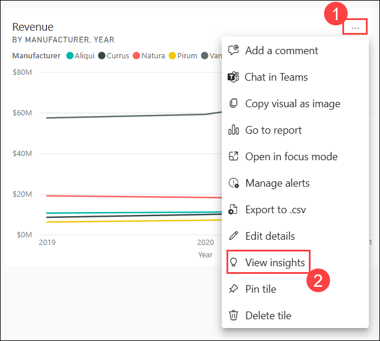
  
1. You will be navigated to **Focus mode** for the line chart.

1. Scroll through the Insights panel to explore the various insights Power BI can generate, and notice the option to pin these insight visuals directly to the dashboard..

    

1. Click **Exit Focus mode** in the top left to navigate back to the dashboard.

    

1. We want to be notified when VanArsdel’s Market Share goes above or below a threshold. We can set up alerts to achieve this.

1. Hover over the **VanArsdel Market Share** tile, then click the **ellipsis (...) (1)** in the top right corner of the tile. From the dropdown, select **Manage alerts (2)** to open the **Manage alerts** dialog box.

    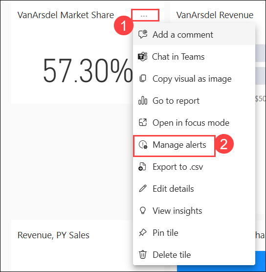

1. On the **Manage alerts** page, click **+ Add alert rule (1)** to open the dialog, then click **Cancel (2)** since we are not creating an alert rule.

    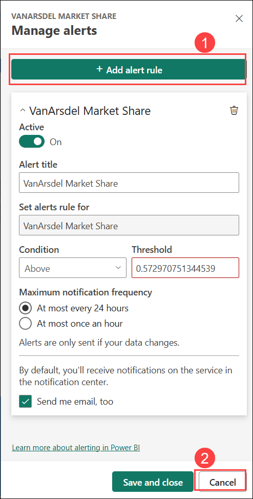
  
    > 📌 **Note:** Notice that you can add **Above** or **Below threshold**. You can also set the notification frequency. This is just an introduction to managing alerts. Complete functionality is not covered in this lab.

1. From the **Unsaved changes** pop-up window, click **Don’t save** to discard any changes made.

   

1. Click the **VanArsdel Market Share** tile on the dashboard to navigate directly to the corresponding report view.

   

1. In the map visual, click on the upwards arrow **↑ (1)** to select the Country level, right-click the **Australia (2)** bubble, click **Drill through (3)** and click then **By Manufacturer (4)**. 
  
    

1. You will be navigated to the **By Manufacturer** page of the report with the **Australia** filter applied to the report page.

1. Hover over the **matrix** visual, then click the **Focus mode** icon on the top right corner of the visual.

    

1. To expand the rows and see more detailed information in the report, click the **"+"** icon next to the category names

    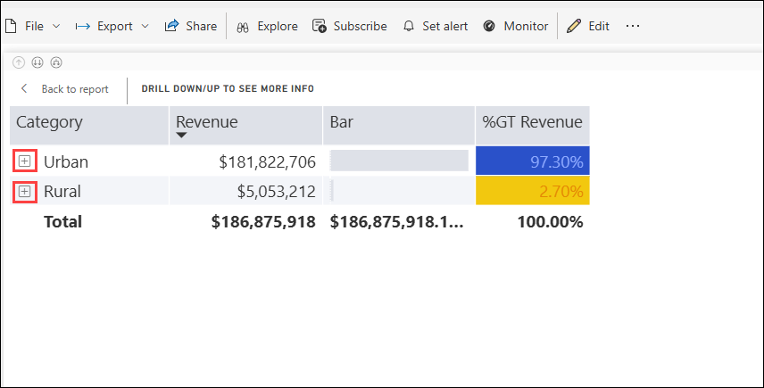

1. Click **Back to report** to return to the standard report view from Focus mode.

    
  
1. From the top right menu, click **Bookmarks (1)** and then click **Show more bookmarks (2)**. The **Bookmark** pane opens on the right. There are two options: **Personal** bookmarks and **Report** bookmarks.

    - **Report bookmarks** are the bookmarks the report author created (we did this in Power BI Desktop).

    - **Personal bookmarks** on the report are ones which the consumer can create on their own.

      

1. From the **Bookmarks** pane, click **Report bookmarks (1)**, then select **View (2)** to browse through the list of **available bookmarks (3)**.

    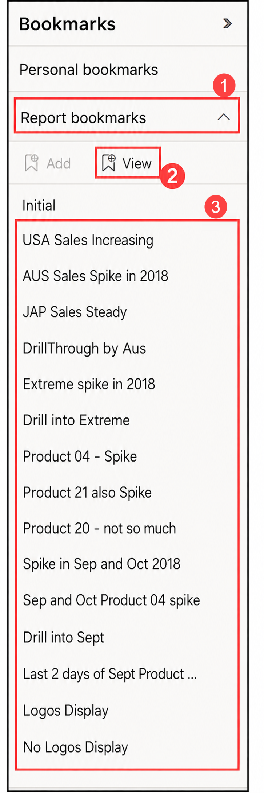  

    > 📌 **Note:** Notice that you can view and navigate through the bookmarks using the arrow at the bottom of the screen. This behavior is like that in Power BI Desktop.

              
  
1. Click **Exit** in the **Bookmark** pane to close it and return to the full report view.

     

1. Power BI provides an option to get quick insights into the complete dataset.

1. In the left panel, click on **DIAD_<inject key="DeploymentID" enableCopy="false"/> (1)** to return to your workspace view, then select the checkbox for **DIAD Final Report (2)** under **Report** type to select it for analysis.

    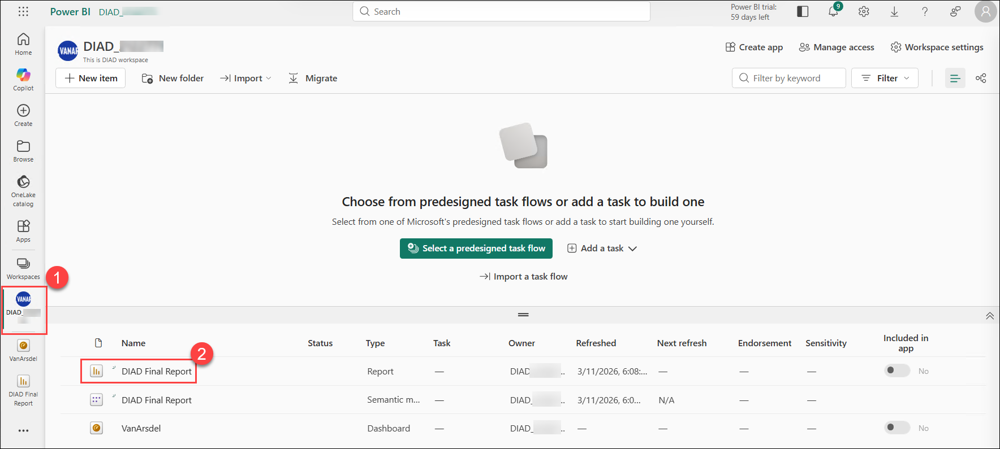 

1. Click the **ellipsis (...) (1)** then click on **Quick insights (2)**. 

   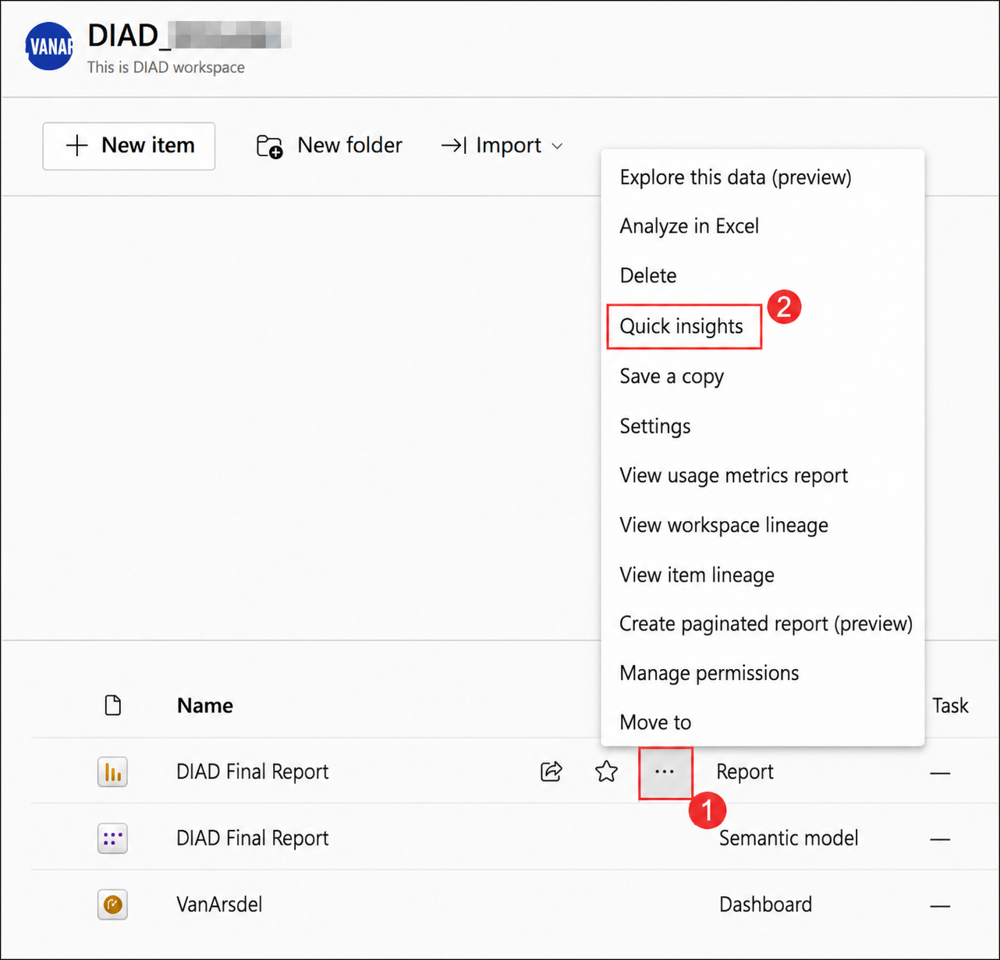
  
    > 📌 **Note:** It might take a few minutes for the insights to be created. Once insights are ready, a message appears in the top right corner.

1. Once insights are ready, click **View insights** to display the comprehensive insights report that Power BI has generated based on your data.

    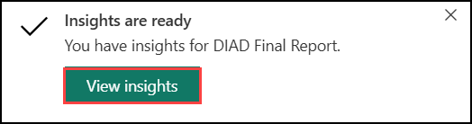
  
    > 📌 **Note:** A quick insights report is displayed based on the dataset. This provides insights into data you may have missed and helps to get a quick start on creating dashboards. Hovering over each report provides an option to **Pin it** to a dashboard.

      

Throughout this lab, you have learned how to apply conditional formatting, add a logo to the manufacturer filter, import a custom visual, and apply a custom theme to the report. You also learned how to add bookmarks to tell a story about the report.

## 📚 References

In the ribbon of the Power BI Desktop, the Help section has links to some great resources.

   

Here are a few more resources that will help you with your next steps with Power BI.

  - Power BI Documents [Power BI | Microsoft Learn](https://learn.microsoft.com/en-us/power-bi/)
  - Power BI Courses [Power BI | Course](http://aka.ms/pbi-create-reports)
  - Support site [Power BI | Support](https://support.powerbi.com/)

  Discover additional Power Platform tools:
  
  - Power Platform [Power Platform | Course](https://powerplatform.microsoft.com/en-us/instructor-led-training/)
  - Power Apps [Power Apps | Microsoft Learn](https://learn.microsoft.com/en-us/power-apps/)
  - Power Automate [Power Automate | Microsoft Learn](https://learn.microsoft.com/en-us/power-automate/)
  - Dataverse [What is Microsoft Dataverse? - Power Apps | Microsoft Docs](https://docs.microsoft.com/en-us/powerapps/maker/data-platform/data-platform-intro)

## ✅ Conclusion

In this exercise, you have completed the following:

- Opened a Power BI report, adjusted the mobile layout, created a workspace, and published the report to the Power BI Service.
- Enabled maps, adjusted the layout, created a workspace, and published the report.
- Created a dashboard combining data from the Market Share report.

### 🎉 You have successfully completed this Lab!
